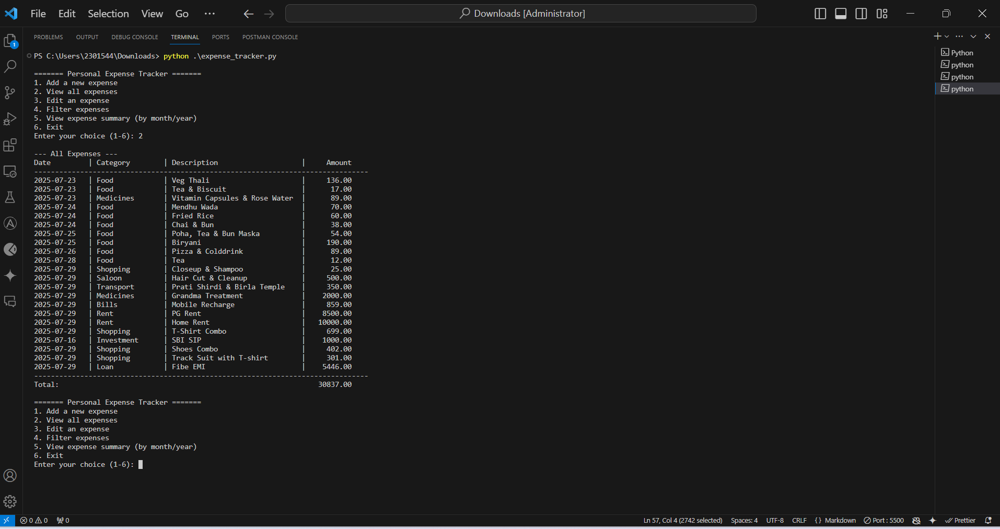

**## 📊💰 Command-Line Expense Tracker**

A simple yet powerful command-line application built with Python 🐍 to help you track your personal expenses. It allows you to ➕ add, 📋 view, ✏️ edit, and 📈 analyze your spending habits directly from your terminal.

All data is stored locally in an expenses.csv file, ensuring your information is 🔒 private and 💾 easily accessible.

---

## 📊 Final Output

After using the tracker, you’ll be able to:

✅ Maintain a clean log of all your expenses.
📆 View monthly/yearly summaries.
🔍 Filter and analyze your spending habits.
📈 Make informed financial decisions based on your data.

---

## 📸 Screenshot Preview

You can find a sample screenshot of the project final output here:

---

## 📦 Repository Structure

📁 expense_tracker_files/
├── 📄 expense_tracker.py       # Main Python script for CLI expense tracking
├── 📄 expenses.csv             # Local data file storing all expenses
├── 📄 README.md                # Project documentation with features and usage
└── 📁 assets/                  # (Optional) Folder for screenshots, icons, or sample data

---

## ✨ Features

➕ Add Expenses: Record new expenses with date, category, description, and amount.
📋 View All Expenses: Display a formatted table of all recorded expenses with a running total.
✏️ Edit Expenses: Modify any detail of a previously entered expense.
🔍 Filter Expenses: Filter your expense history by category, year, and/or month.
📈 Summarize Spending: Get a summary of total expenses grouped by month and year.
💾 Persistent Storage: All data is saved locally in expenses.csv.

---

## 📝 Required Fields

When adding or editing an expense, the following fields are used:

📅 Date: Format YYYY-MM-DD. Defaults to today if blank.
🏷️ Category: E.g., Food, Transport, Bills.
📝 Description: A brief note about the expense.
💵 Amount: Numerical cost of the expense.

---

## 🧠 Technical Description

📦 Data Storage: Uses Python's csv module.
📁 File Handling: Uses os to check for file existence.
🕒 Date & Time: Uses datetime for date validation and defaults.
➗ Data Aggregation: Uses collections.defaultdict for summaries.
🖥️ CLI Interface: Interactive terminal-based navigation.

---

## ▶️ How to Run

1. Ensure Python 🐍 is installed.
2. Save the script as expense_tracker.py.
3. Open your terminal 💻.
4. Navigate to the script directory.
5. Run: python expense_tracker.py
6. The script will create expenses.csv in the same directory.

---

## 👤 Author

**Ritesh Raut**  
*Programmer Analyst, Cognizant*

💻 Track Smart. Spend Wise. 💸 — Your CLI Expense Buddy!

---

### 🌐 Connect with me:

---
